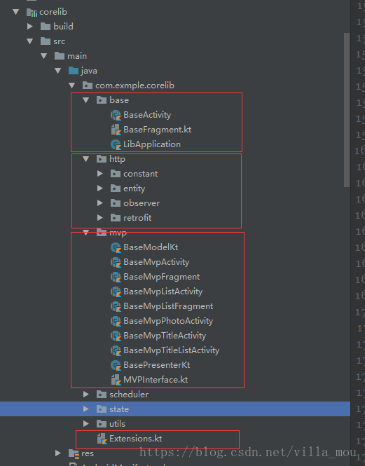
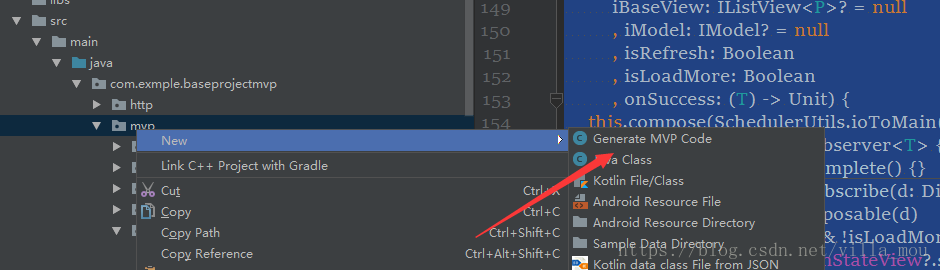
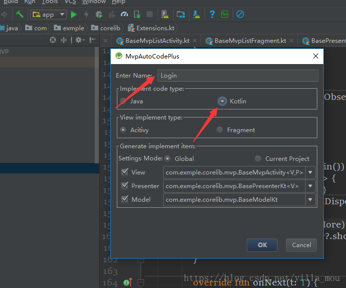
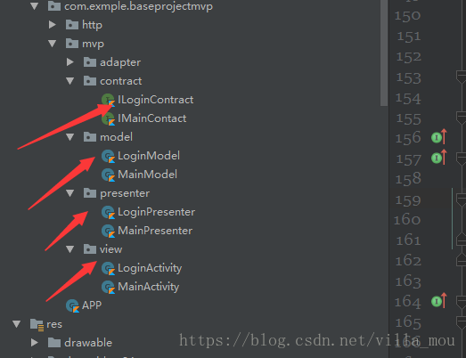

# KotlinMvpExample
一个kotlin+mvp+retrofit+Rxjava的开发基础lib
####  简介
* 关于Android程序的构架,主要有MVC，MVP和MVVM。MVC相对于较为落后，耦合度太高、职责不明确；MVVM其实就是在mvp的基础上采用DataBind，普及性不如MVP，况且Google官方提供了Sample代码来展示MVP模式的用法，所以目前大部分项目采用的还是MVP，当然根据项目的情况以及项目的大小来采用合适的结构才是合理的。

*  Kotlin是由JetBrains创建的基于JVM的编程语言，IntelliJ正是JetBrains的杰作，而Android Studio是基于IntelliJ修改而来的。Kotlin是一门包含很多函数式编程思想的面向对象编程语言。Kotlin生来就是为了弥补Java缺失的现代语言的特性，并极大的简化了代码，使得开发者可以编写尽量少的样板代码。所以目前来说kotlin的Android开发者中的普及率越来越大，这应该是一个很大的趋势。所以学习和使用kotlin是一个Android开发者必备的技能

*  Retrofit: Retrofit是Square 公司开发的一款正对Android 网络请求的框架。底层基于OkHttp 实现。
RxJava:RxJava 在 GitHub 主页上的自我介绍是 "a library for composing asynchronous and event-based programs using observable sequences for the Java VM"（一个在 Java VM 上使用可观测的序列来组成异步的、基于事件的程序的库）。这就是 RxJava ，概括得非常精准。总之就是让异步操作变得非常简单。
**各自的职责**：Retrofit 负责请求的数据和请求的结果，使用接口的方式呈现，OkHttp 负责请求的过程，RxJava 负责异步，各种线程之间的切换。
RxJava + Retrofit  已成为当前Android 网络请求最流行的方式。
####  MVP具体实现
首先既然采用了MVP，肯定必不可少具M层，V层，P层的基础接口，封装一个公共的操作，看一下具体实现
我把顶级的接口分成了两层，这样有利于在写泛型的时候没那么麻烦
先看下目录结构


*  顶级接口
第一层

```
interface ITopView : LifecycleOwner {
    fun getCtx(): Context?
    fun inited()
    fun finish(resultCode: Int = Activity.RESULT_CANCELED)
    fun showLoading(@NotNull msg: String)
    fun showLoading(@StringRes srtResId: Int)
    fun dismissLoading()
    fun showToast(@StringRes srtResId: Int)
    fun showToast(@NotNull message: String)
}

interface ITopPresenter : LifecycleObserver {
    fun attachView(view: ITopView)
    @OnLifecycleEvent(Lifecycle.Event.ON_DESTROY)
    fun detachView()
}


interface ITopModel {
    fun onDetach()
}

```
第二层

```
interface IView<P : ITopPresenter> : ITopView {
    var mPresenter: P
    override fun inited() {
        mPresenter.attachView(this)
    }
}

interface IPresenter<V : ITopView, M : IModel> : ITopPresenter {
    var mView: V?
    var mModel: M?
    fun getContext() = mView?.getCtx()

    @Suppress("UNCHECKED_CAST")
    override fun attachView(view: ITopView) {
        mView = view as V
        mView?.lifecycle?.addObserver(this)
    }

    override fun detachView() {
        mModel?.onDetach()
        mModel = null
        mView = null
    }

    //判断是否初始化View
    private val isViewAttached: Boolean
        get() = mView != null

    fun checkViewAttached() {
        if (!isViewAttached) throw MvpViewNotAttachedException()
    }
    private class MvpViewNotAttachedException internal constructor() : RuntimeException("Please call IPresenter.attachView(IBaseView) before" + " requesting data to the IPresenter")

}

interface IModel : ITopModel {
    val mDisposablePool: CompositeDisposable

    fun addDisposable(disposable: Disposable) {
        mDisposablePool.add(disposable)
    }

    override fun onDetach() {
        if (!mDisposablePool.isDisposed) {
            mDisposablePool.clear()
        }
    }
}


```
还有额外的一个列表的V层，主要是对列表界面数据统一处理

```
interface IListView<P : ITopPresenter> :IView<P>{
    val mRecyclerView: RecyclerView?
    val mStateView: IStateView?
    val mRefreshLayout:SmartRefreshLayout
    fun loadMoreFail(isRefresh: Boolean)
}
```
然后M的基类

```
open class BaseModelKt {
    val mDisposablePool: CompositeDisposable by lazy { CompositeDisposable() }
}
```

然后P的基类

```
open class BasePresenterKt<V : ITopView> {
    var mView: V? = null
}
```

* Activity和Fragment的封装

	首先的MVPActivity的实现

```
abstract class BaseMvpActivity<V : ITopView, P : ITopPresenter> : BaseActivity(), IView<P> {
    override fun onCreate(savedInstanceState: Bundle?) {
        super.onCreate(savedInstanceState)
        inited()
    }
    override fun getCtx() = this
    override fun showLoading(msg: String) {
        progressDialog?.showProgressDialogWithText(msg)
    }

    override fun finish(resultCode: Int) {
        finish()
    }

    override fun showLoading(srtResId: Int) {
        progressDialog?.showProgressDialogWithText(resources.getString(srtResId))
    }

    override fun dismissLoading() {
        progressDialog?.dismissProgressDialog()
    }

    override fun showToast(message: String) {
        showToastBottom(message)
    }

    override fun showToast(srtResId: Int) {
        showToast(resources.getString(srtResId))
    }
}
```

然后MVPFragment的实现

```
abstract class BaseMvpFragment<V : ITopView, P : ITopPresenter> : BaseFragment(), IView<P> {
    override fun getCtx() = context

    override fun onActivityCreated(savedInstanceState: Bundle?) {
        super.onActivityCreated(savedInstanceState)
        inited()
    }
    override fun finish(resultCode: Int) {
    }
    override fun showToast(message: String) {
        showToastBottom(message)
    }
    override fun showToast(srtResId: Int) {
        showToast(resources.getString(srtResId))
    }
    override fun showLoading(msg: String) {
        showProgressDialog(msg)
    }

    override fun showLoading(srtResId: Int) {
        showProgressDialog(resources.getString(srtResId))
    }

    override fun dismissLoading() {
        dismissProgressDialog()
    }
}
```
然后封装一个带toolBar的MVPTitleActivity，它是MVPActivity的子类

```
abstract class BaseMvpTitleActivity<V : ITopView, P : ITopPresenter> : BaseMvpActivity<V, P>() {
    private var rightMenuTexts: String? = null
    private var rightMenuIcons: Int? = null
    private var titleTv: TextView? = null
    @LayoutRes
    protected abstract fun childView(): Int

    override fun getContentView() = R.layout.activtiy_base_title
    override fun initView() {
        val container = this.findViewById<FrameLayout>(R.id.base_container)
        container.addView(layoutInflater.inflate(childView(), null))
        val toolbar = this.findViewById<Toolbar>(R.id.base_toolbar)
        titleTv = this.findViewById(R.id.base_title_tv)
        toolbar.title = ""
        setSupportActionBar(toolbar)
        if (hasBackIcon()) {
            toolbar.setNavigationIcon(R.drawable.return_icon)
            toolbar.setNavigationOnClickListener { finish() }
        }
    }

    open fun hasBackIcon() = true
    override fun onCreateOptionsMenu(menu: Menu): Boolean {
        rightMenuIcons?.let {
            val item = menu.add(0, 0, 0, "")
            item.icon = ContextCompat.getDrawable(this, it)
            item.setShowAsAction(Menu.FLAG_ALWAYS_PERFORM_CLOSE)
        }
        rightMenuTexts?.let {
            val item = menu.add(0, 0, 0, "")
            item.title = it
            item.setShowAsAction(Menu.FLAG_ALWAYS_PERFORM_CLOSE)
        }
        return true
    }

    override fun onOptionsItemSelected(item: MenuItem): Boolean {
        onRightMenuClick(item.itemId)
        return false
    }

    /**
     * 设置toolbar右边的文字
     */
    fun setRightMenuTexts(rightMenuText: String) {
        this.rightMenuTexts = rightMenuText
    }

    /**
     * 设置toolbar右边的icon
     */
    fun setRightMenuIcons(@DrawableRes rightIconResId: Int) {
        this.rightMenuIcons = rightIconResId
    }

    /**
     * 当toolbar右边的icon，被点击，数据0,1,2,3
     */
    open fun onRightMenuClick(itemId: Int) {
    }

    /**
     * 设置中间的title
     */
    protected fun setActivityTitle(@StringRes strResId: Int) {
        titleTv?.setText(strResId)
    }

    protected fun setActivityTitle(text: String) {
        titleTv?.text = text
    }

    /**
     * 设置中间title的颜色
     */
    fun setActivityTitleColor(@ColorRes colorId: Int) {
        titleTv?.setTextColor(resources.getColor(colorId))
    }
}
```

这样基本的封装基本就结束了

但是还可以对列表进行封装，**封装了视图状态，下拉刷新**
来看看MVPListActivity,MVPListFragment,MvpTitleListAcitivty的封装

```
abstract class BaseMvpListActivity<V : ITopView, P : ITopPresenter> : BaseMvpActivity<V, P>(), IListView<P> {
    override fun getContentView() = R.layout.layout_list
    override val mStateView: IStateView by lazy { list_sv }
    override val mRecyclerView: RecyclerView by lazy { list_rv }
    override val mRefreshLayout: SmartRefreshLayout by lazy { refreshLayout }

    override fun initView() {
        //设置列表背景色
        list_rv.setBackgroundColor(ContextCompat.getColor(this, setRecyclerViewBgColor))
        //重试
        list_sv.onRetry = { onRetry() }
        //刷新
        refreshLayout.setOnRefreshListener { onRefresh() }
        //设置下拉刷新是否可用
        refreshLayout.isEnabled = setRefreshEnable
    }

    abstract fun onRefresh()
    abstract fun onRetry()
    open val setRecyclerViewBgColor = R.color.white
    open val setRefreshEnable = true
}

abstract class BaseMvpListFragment<V : ITopView, P : ITopPresenter> : BaseMvpFragment<V, P>(), IListView<P> {
    override fun getContentView() = R.layout.layout_list
    override val mStateView: IStateView by lazy { list_sv }
    override val mRecyclerView: RecyclerView by lazy { list_rv }
    override val mRefreshLayout: SmartRefreshLayout by lazy { refreshLayout }
    override fun initData() {
        //设置背景色
        context?.let { list_rv.setBackgroundColor(ContextCompat.getColor(it, setRecyclerViewBgColor)) }
        //重试
        list_sv.onRetry = { onRetry() }
        //刷新
        refreshLayout.setOnRefreshListener { onRefresh() }
        //设置下拉刷新是否可用
        refreshLayout.isEnabled = setRefreshEnable
    }

    abstract fun onRefresh()
    abstract fun onRetry()
    open val setRecyclerViewBgColor = R.color.white
    open val setRefreshEnable = true
}

abstract class BaseMvpTitleListActivity<V : ITopView, P : ITopPresenter> : BaseMvpTitleActivity<V, P>(), IListView<P> {
    override fun childView()= R.layout.layout_list
    override val mStateView: IStateView by lazy { list_sv }
    override val mRecyclerView: RecyclerView by lazy { list_rv }
    override val mRefreshLayout: SmartRefreshLayout by lazy { refreshLayout }
    override fun initView() {
        super.initView()
        //设置背景色
        list_rv.setBackgroundColor(ContextCompat.getColor(this, setRecyclerViewBgColor))
        //重试
        list_sv.onRetry = { onRetry() }
        //刷新
        refreshLayout.setOnRefreshListener { onRefresh() }
        //设置下拉刷新是否可用
        refreshLayout.isEnabled = setRefreshEnable
    }
    abstract fun onRefresh()
    abstract fun onRetry()
    open val setRecyclerViewBgColor = R.color.white
    open val setRefreshEnable = true
}

```

这样MVP的大致架构基本已经封装好了

####  网络框架的具体实现

* retrofit的封装
这个apiService我才用泛型回调，这样可以根据不同的模块创建不同的retrofit工厂类，这个也有利用模块化开发
```
abstract class RetrofitFactory<T> {
    private val time_out: Long = 15//超时时间
    var apiService: T

    init {
        val httpClient = OkHttpClient.Builder()
                .addInterceptor { chain ->
                    val builder = chain.request().newBuilder()
                    // 添加请求头header
                    if (getToken().isNotEmpty()) {
                        builder.header("userToken", getToken())
                    }
                    val build = builder.build()
                    chain.proceed(build)
                }
                .addInterceptor(HttpLoggingInterceptor(HttpLoggingInterceptor.Logger { message ->
                    if (message.contains("{")||message.contains("=")||message.contains("http")
                            ||message.contains("userToken")){
                        Logger.e("${message}")
                    }
                }).setLevel(HttpLoggingInterceptor.Level.BODY))//设置打印得日志内容
                .connectTimeout(time_out, TimeUnit.SECONDS)
                .readTimeout(time_out, TimeUnit.SECONDS)
                .build()

        apiService = Retrofit.Builder()
                .baseUrl(URLConstant.BASE_URL)
                .addConverterFactory(GsonConverterFactory.create(buildGson())) // 添加Gson转换器
                .addCallAdapterFactory(RxJava2CallAdapterFactory.create()) // 添加Retrofit到RxJava的转换器
                .client(httpClient)
                .build()
                .create(getApiService())
    }

    abstract fun getApiService(): Class<T>
    abstract fun getToken(): String
    private fun buildGson(): Gson {
        return GsonBuilder()
                .setDateFormat("yyyy-MM-dd HH:mm:ss")
                .create()
    }

    fun getService(): T {
        return apiService
    }
}
```

 * Rxjava+Retrofit的封装
 这个部分是网络请求的部分，我是封装在kotlin的拓展方法里面，这样就可以使用lambda表达式进行网络请求，代码量贼少，用起来贼舒服**，一行代码一个请求**
具体使用例子

```
  PersonRetrofit.apiService.getIdentityCode(phone).mySubscribe(view, "正在获取验证码...") {
            view.getCodeSuccess()
        }
```
是不是贼简单，贼方便，这个得感谢我的同学大强哥，这招都是他教我的，把lambda用到极致；

再来看看kotlin的拓展内部实现；

```
fun <T : BaseBean, P : ITopPresenter> Observable<T>.mSubscribe(
        iBaseView: IView<P>? = null
        , iModel: IModel? = null
        , msg: String = ""
        , onSuccess: (T) -> Unit) {
    this.compose(SchedulerUtils.ioToMain())
            .subscribe(object : Observer<T> {
                override fun onComplete() {
                    iBaseView?.dismissLoading()
                }

                override fun onSubscribe(d: Disposable) {
                    iModel?.addDisposable(d)
                    iBaseView?.showLoading(if (msg.isEmpty()) "请求中..." else msg)
                    if (!NetworkUtils.isConnected()) {
                        showToastBottom("连接失败,请检查网络状况!")
                        onComplete()
                    }
                }

                override fun onNext(t: T) {
                    if (t.code == CodeStatus.SUCCESS) {
                        onSuccess.invoke(t)
                    } else if (t.code == CodeStatus.LOGIN_OUT) {//重新登录
//                val currentActivity = ActivityUtils.currentActivity()
//                UserManager.getInstance().clear()
//                EMClient.getInstance().logout(true)
//                showToastBottom("登录过期，请重新登录")
//                val intent = Intent(currentActivity, LoginActivity::class.java)
//                intent.flags = Intent.FLAG_ACTIVITY_NEW_TASK
//                currentActivity?.startActivity(intent)
                    } else {
                        if (!t.msg.isNullOrEmpty()) {
                            t.msg?.let { showToastBottom(it) }
                        } else {
                            showToastBottom("请求失败")
                        }
                    }
                }

                override fun onError(e: Throwable) {
                    iBaseView?.dismissLoading()
                    if (e is SocketTimeoutException || e is ConnectException) {
                        showToastBottom("连接失败,请检查网络状况!")
                    } else if (e is JsonParseException) {
                        showToastBottom("数据解析失败")
                    } else {
                        showToastBottom("请求失败")
                    }
                }
            })
}

fun <T : BaseBean, P : ITopPresenter> Observable<T>.listSubcribe(
        iBaseView: IListView<P>? = null
        , iModel: IModel? = null
        , isRefresh: Boolean
        , isLoadMore: Boolean
        , onSuccess: (T) -> Unit) {
    this.compose(SchedulerUtils.ioToMain())
            .subscribe(object : Observer<T> {
                override fun onComplete() {}
                override fun onSubscribe(d: Disposable) {
                    iModel?.addDisposable(d)
                    if (!isRefresh && !isLoadMore) {
                        iBaseView?.mStateView?.showLoading()
                    }
                }

                override fun onNext(t: T) {
                    if (t.code == CodeStatus.SUCCESS) {
                        iBaseView?.mStateView?.showSuccess()
                        onSuccess.invoke(t)
                    } else if (t.code == CodeStatus.LOGIN_OUT) {//重新登录
//                    UserManager.getInstance().clear()
//                    showToastBottom("登录过期，请重新登录")
//                    EMClient.getInstance().logout(true)
//                    val intent = Intent(currentActivity, LoginActivity::class.java)
//                    intent.flags = Intent.FLAG_ACTIVITY_NEW_TASK
//                    currentActivity.startActivity(intent)
                    } else {
                        iBaseView?.mStateView?.showError()
                    }
                }

                override fun onError(e: Throwable) {
                    if (!isLoadMore) {
                        iBaseView?.mStateView?.showError()
                    } else {
                        iBaseView?.loadMoreFail(isRefresh)
                    }
                }
            })
}
```

####  配合插件使用，快速开发必备
这里我推荐一个我同学的插件，结合这种lib使用贼方便
插件的名字叫MvpAutoCodePlus，github地址 [插件地址](https://github.com/longforus/MvpAutoCodePlus)，，，这个low比名字还是我帮他取的。
具体使用





这样就生成了，真的很方便


最后我写了一个demo放在github上面 [项目地址](https://github.com/mouxuefei/KotlinMvpExample)

如果大家喜欢,请关注我的公众号,感谢大家支持,地址如下:


